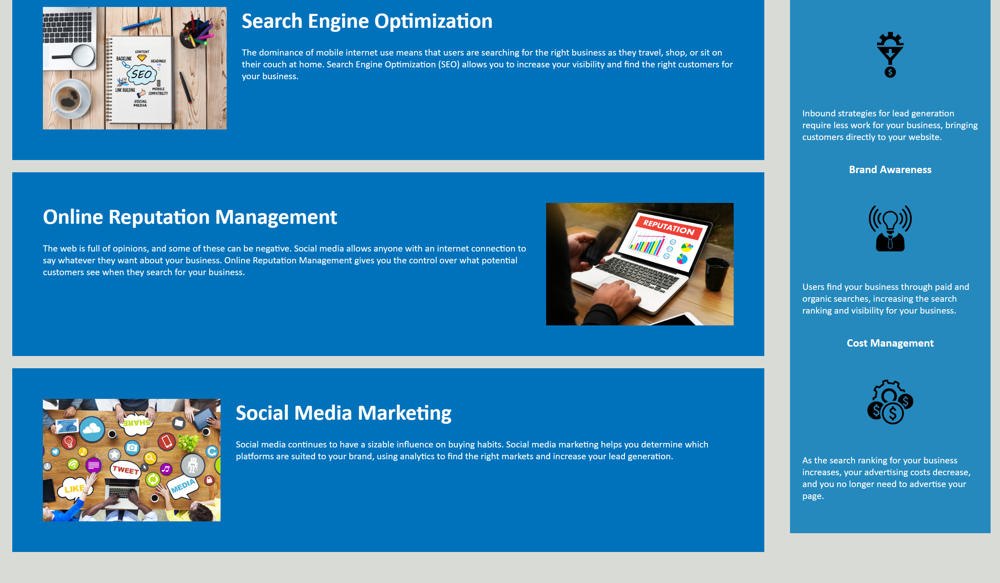

# horiseon-code-refactor

Welcome to the horiseon-code-refactor app! This simple application allows you to view a companies agenda. This assignment was given to me by my boot-camp. 

## Acceptance Criteria
~~~
GIVEN a webpage meets accessibility standards
WHEN I view the source code
THEN I find semantic HTML elements
WHEN I view the structure of the HTML elements
THEN I find that the elements follow a logical structure independent of styling and positioning
WHEN I view the image elements
THEN I find accessible alt attributes
WHEN I view the heading attributes
THEN they fall in sequential order
WHEN I view the title element
THEN I find a concise, descriptive title
~~~

## Reflection

As I developed the webpage, I paid close attention to meeting the acceptance criteria for accessibility standards. Here's a reflection on how I addressed each criterion:

Semantic HTML Elements:
To ensure the webpage's source code meets accessibility standards, I utilized semantic HTML elements appropriately. I used `<h1>` for the main heading, `<h2>` for section headings, and  `
` for paragraphs. These elements convey the structural hierarchy of the content, making it more accessible and understandable to screen readers and other assistive technologies.

Logical Structure Independent of Styling and Positioning:
I made sure that the structure of the HTML elements follows a logical order regardless of styling or positioning. By separating the content from the presentation, the webpage remains accessible even if the styling is disabled or overridden. This enhances the user experience and ensures that the content can be easily navigated and understood by all users.

Accessible Alt Attributes for Images:
To ensure images are accessible, I provided descriptive alt attributes for each image element. The alt attribute conveys the content and purpose of the image to users who may not be able to see the image. This allows screen readers to read out the alternative text, providing a meaningful description of the image.

Sequential Order of Heading Attributes:
I ensured that the heading attributes (`<h1>`, `<h2>`, etc.) follow a sequential order, maintaining a logical structure in the document outline. Sequential headings help users navigate and understand the content more easily. They also contribute to a well-organized and accessible reading experience for users who rely on screen readers or other assistive technologies.

Concise and Descriptive Title Element:
To provide a concise and descriptive title, I included the `<title>` element in the HTML document. The title accurately reflects the purpose or topic of the webpage, allowing users to identify and differentiate it from other pages when using browser tabs or bookmarking. A clear and descriptive title enhances accessibility and improves the overall user experience.

In conclusion, I am confident that the webpage meets the acceptance criteria for accessibility standards. By implementing semantic HTML elements, maintaining a logical structure, providing accessible alt attributes, using sequential heading attributes, and including a concise and descriptive title element, the webpage ensures a more inclusive and accessible experience for all users.

## Screenshots

*Landing section figure 1*

*Information section figure 2*

## Installation

To run the Horiseon app locally, follow these steps:

1. Clone the repository to your local machine.

2. Navigate to the project directory.

3. Open the `index.html` file in your preferred web browser.

That's it! You can now start using the Horiseon app.

## Contact Me
I am open to collaboration and would love to connect with fellow developers. You can reach me via:

- Email: cortesnicholas04@gmail.com
- LinkedIn: https://www.linkedin.com/in/nicholas-cortes-9912b2269/
- Portfolio: https://ncortes04.github.io/My-Portfolio/

Feel free to connect with me, and let's discuss exciting opportunities or ideas!